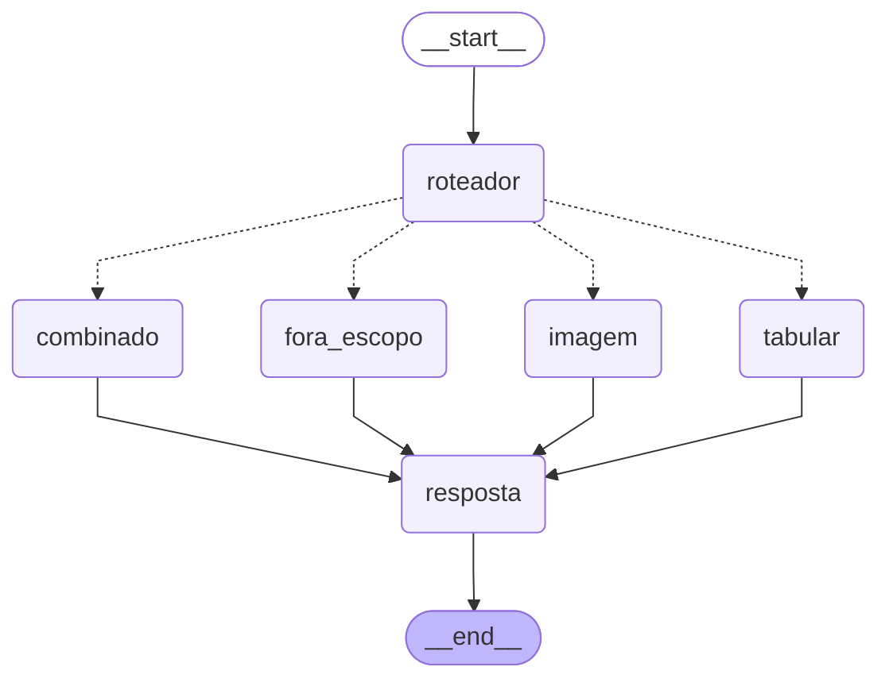

```mermaid
---
config:
  flowchart:
    curve: linear
---
graph TD;
	__start__([<p>__start__</p>]):::first
	roteador(roteador)
	tabular(tabular)
	imagem(imagem)
	combinado(combinado)
	fora_escopo(fora_escopo)
	resposta(resposta)
	__end__([<p>__end__</p>]):::last
	__start__ --> roteador;
	combinado --> resposta;
	fora_escopo --> resposta;
	imagem --> resposta;
	roteador -.-> combinado;
	roteador -.-> fora_escopo;
	roteador -.-> imagem;
	roteador -.-> tabular;
	tabular --> resposta;
	resposta --> __end__;
	classDef default fill:#f2f0ff,line-height:1.2
	classDef first fill-opacity:0
	classDef last fill:#bfb6fc

```